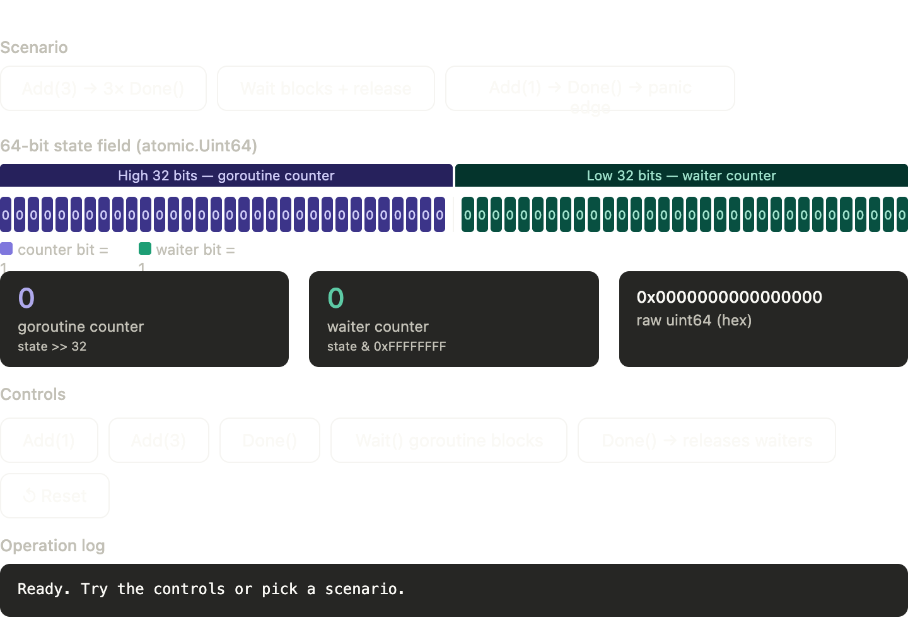

# Goroutines in Go

## Overview
Goroutines allow concurrent execution of functions with minimal overhead, making it easy to write scalable concurrent programs.

## Key Characteristics
- **Lightweight**: Thousands of goroutines can run simultaneously
- **Managed by runtime**: No manual thread management needed
- **Multiplexed**: Many goroutines run on fewer OS threads
- **Simple syntax**: Use the `go` keyword to launch

## So goroutines are threads?
To people new to Go, the word goroutine and thread get used a little interchangeably. This makes sense if you come from a language such as Java where you can quite literally make new OS threads. Go is different, and **a goroutine is not the same as a thread**. Threads are much more expensive to create, use more memory and switching between threads takes longer. Goroutines are an abstraction over threads and a single Operating System thread can run many goroutines.

## Basic Syntax
```go
go functionName()
go func() {
    // code here
}()
```

## Example 1: Simple Goroutine
```go
package main

import (
    "fmt"
)

func PrintNumbers(num int) {
    fmt.Println(num)
}

func main() {
    for i := 0; i <= 10; i++ {
        go PrintNumbers(i)
    }
}

// Above code won't print anything because of go routine scheduling this task to different threads and before they get completed the main function exists end up killing them.
```

# Go Concurrency: Why Goroutines Exit When `main()` Finishes

This is one of the **most important concepts in Go concurrency** — **Goroutines + Main Function Exit**.

---

## 1. Your Code

```go
func PrintNumbers(num int) {
    fmt.Println(num)
}

func main() {
    for i := 0; i <= 10; i++ {
        go PrintNumbers(i)
    }
}
```

You expect:
```
0 1 2 3 4 5 6 7 8 9 10
```

But instead nothing prints (or partial output).

---

## 2. Important Rule

**When main() exits → program exits → all goroutines are killed**
---

## 3. Are goroutines called in the order I declared them?
  
**No**

Most Operating Systems have something called a preemptive scheduler. This means that which thread is executed next is determined by the OS itself based on thread priority and other things like waiting to receive data over the network. Since goroutines are abstractions over threads, they all have the same priority and we therefore cannot control the order in which they run.
There has been discussions as far back as 2016 (you can read one such discussion [here](https://groups.google.com/g/golang-dev/c/HJcGESXfJfs)) about adding the ability to set priority on individual goroutines, but there is some pretty compelling points raised as to why its not a good idea.

---

## 4.How do I ensure my program is as performant as possible?

- There is an environment variable (**GOMAXPROCS**) that you can set which determines how many threads your go program will use simultaneously. You can use this great library from [Uber](https://github.com/uber-go/automaxprocs) to automatically set the GOMAXPROCS variable to match a Linux container CPU quota. If you are running Go workloads in Kubernetes, you should use this.
- If you set GOMAXPROCS to be 3, this means that the program will only execute code on 3 operating system threads at once, even if there are 1000s of goroutines.
- It begs the question though, does setting GOMAXPROCS to the biggest value possible mean your program will be faster?
- The answer is **no**, and it actually might make it slower. There are a few reasons for this, but the main reason is to do with context switching.
- Swapping between threads is a relatively slow operation, and can take up to 1000ns as oppose to switching between goroutines on the same thread which takes ~200ns. Therefore you may find that for your particular workload, your program is faster with a lower GOMAXPROCS value. Always profile and benchmark your programs and make sure the Go runtime configuration is only changed if absolutely required.
---

## 4. Internal Working
- The Main Goroutine is the Anchor. When you run a Go program, the Go runtime automatically creates a single, primary goroutine. This is known as the Main Goroutine. It is responsible for initializing the program and executing the main() function.
- Every other goroutine you create using the go keyword is spawned from this main "thread"(see, it's hard to avoid this word when discussing them!) of execution, but they are treated as independent, concurrent tasks by the Go scheduler.

### The Rule of Termination**
- The fundamental rule of Go concurrency is: The lifecycle of the entire Go program is tied strictly to the Main Goroutine.
- Unlike some other programming languages where the main thread will wait for all background threads to finish before shutting down, Go does not do this automatically. 
- The Go runtime does not keep track of whether spawned goroutines have finished their work.
- **main() finishes**: When the final line of code in main() is executed (or os.Exit() is called).
- **Runtime triggers shutdown**: The Go program immediately begins its teardown process.
- **Goroutines are killed**: Any other goroutines that are currently running, sleeping, or blocked are abruptly terminated. Their execution stops instantly, and any pending defer statements inside those goroutines are not executed.
```
Time
 |    [Main Goroutine]                 [Goroutine 1]            [Goroutine 2]
 |          |                                |                        |
 |        main() starts                      |                        |
 |          |                                |                        |
 |       go PrintNumbers(0) ---------------->+ (starts)               |
 |          |                                |                        |
 |       go PrintNumbers(1) ----------------------------------------->+ (starts)
 |          |                                |                        |
 |      main() does work                    ...                      ...
 |      (e.g., brief sleep)                 ...                      ...
 |          |                                |                        |
 |        main() EXITS                       |                        |
 V          |                                |                        |
===================================================================================
      PROGRAM TERMINATES                  (KILLED)                 (KILLED)
      Memory is freed.                Work left unfinished.    Work left unfinished.
===================================================================================
```
---
## How to Prevent This (Synchronization)
1. **Bad Fix (Sleep)**
Don't rely on sleep method to handle this because we don't know how much time the other go routines would take to get completed.
```go
time.Sleep(time.Second*10)
```
2. If you want the main program to wait for its spawned goroutines to finish their jobs before it exits, you must explicitly tell the Main Goroutine to wait.
The most common and idiomatic way to do this in Go is by using a sync.WaitGroup(We will learn about it in coming chapters):
- Add the number of goroutines you are spawning to the WaitGroup.
- Done is called by each goroutine when it finishes its work.
- Wait is called at the end of main(), which blocks the Main Goroutine from exiting until the WaitGroup counter reaches zero.
```go
package main

import (
	"fmt"
	"sync"
	"time"
)

func PrintNumbers(id int, wg *sync.WaitGroup) {
	defer wg.Done() // Decrement the counter when the goroutine completes
	
	for i := 1; i <= 3; i++ {
		fmt.Printf("Goroutine %d: %d\n", id, i)
		time.Sleep(100 * time.Millisecond)
	}
}

func main() {
	var wg sync.WaitGroup

	wg.Add(2) // We are waiting for 2 goroutines

	go PrintNumbers(0, &wg)
	go PrintNumbers(1, &wg)

	wg.Wait() // main() pauses here until both goroutines call wg.Done()
	fmt.Println("All goroutines finished. Main exiting cleanly.")
}
```
---

## 6. Key Takeaways

- main is also a goroutine
- program ends when main ends
- goroutines are async & non-deterministic
- use WaitGroup / channels for sync

---

## Interview One-liner

Goroutines don't block main; when main exits, all goroutines terminate unless explicitly synchronized.

## Best Practices
- Always synchronize goroutines using channels or `sync.WaitGroup`
- Avoid leaving goroutines hanging without completion
- Handle panics in goroutines appropriately
- Be cautious with shared memory; prefer channels for communication
- We will read about channels and WaitGroup in coming lectures
- Refer https://www.youtube.com/watch?v=rAhmryWS3Ng&list=PLXQpH_kZIxTWUe-Ee-DZEX5gfeoo4tHV6&index=24 , 

----
# Go WaitGroup
- Go makes it very easy to write concurrent code. Start a few goroutines, wait for all of them to finish, and done. The go keyword makes this a breeze, and with the 
**sync.WaitGroup** primitive that allows us to wait for a group of goroutines to finish, synchronization can be achieved with no hassle. So it so hassle free? ==> **NO**
- If a WaitGroup is explicitly passed into functions, it should be done by **pointer**.
- A goroutine is done when the function it invokes returns/completes the execution.
  
## How It Works ?
WaitGroup exports 3 methods.
1. **Add(int)**	It increases WaitGroup counter by given integer value.
2. **Done()**	It decreases WaitGroup counter by 1, we will use it to indicate termination of a goroutine.
3. **Wait()**	It Blocks the execution until it's internal counter becomes 0.
Note: WaitGroup is concurrency safe, so its safe to pass pointer to it as argument for Goroutines.
```go
package main

import (
    "fmt"
	"sync"
)

// func PrintNumbers(num int) {
//     fmt.Println(num)
// }

// func main() {
//     for i := 0; i <= 10; i++ {
//         go PrintNumbers(i) // This won't print unless we use waitGroups
//     }
// }

func PrintNumbers(num int, wg *sync.WaitGroup) {
	defer wg.Done()
    fmt.Println(num)
}

func main(){
	var waitGroup sync.WaitGroup
	for i:= 0; i<=10; i++{
		waitGroup.Add(1)
		go PrintNumbers(i, &waitGroup)
	}
	waitGroup.Wait()
}
```
## Depth About WaitGroup

The WaitGroup implementation is actually quite interesting to look at. We can learn a lot about writing concurrent code in Go and about the runtime and the Go scheduler. Let's take a look at the WaitGroup struct:

```go
// A WaitGroup waits for a collection of goroutines to finish.
// The main goroutine calls Add to set the number of goroutines to wait for.
// Then each of the goroutines runs and calls Done when finished. At the same
// time, Wait can be used to block until all goroutines have finished.
//
// A WaitGroup must not be copied after first use.
type WaitGroup struct {
	noCopy noCopy

	// Bits (high to low):
	//   bits[0:32]  counter
	//   bits[32]    flag: synctest bubble membership
	//   bits[33:64] wait count
	state atomic.Uint64
	sema  uint32
}

// waitGroupBubbleFlag indicates that a WaitGroup is associated with a synctest bubble.
const waitGroupBubbleFlag = 0x8000_0000
```
- The first thing that stands out is the **noCopy** field. This isn't data; it's a clever trick. If you try to copy a WaitGroup after its first use, the Go vet tool will yell at you. Why? Because copying it would mean the counter and waiters wouldn't be shared correctly, leading to chaos. Think of it like trying to photocopy a shared to-do list – everyone ends up with different versions!
```go
wg := sync.WaitGroup{}

wg.Add(1)

wgCopy := wg   // ❌ Copy happens here

go func() {
    wgCopy.Done() // modifies copied version
}()

wg.Wait() // original still waiting forever
```

- The second thing is the state field, an atomic.Uint64. This is where the magic happens. Instead of using separate variables (and a mutex!) for the goroutine counter (how many Done() calls are still needed) and the waiter counter (how many goroutines are blocked on Wait()), it packs them both into one 64-bit integer. The high 32 bits track the main counter, and the low 32 bits track the waiters. This atomic variable allows multiple goroutines to update and read the state safely and efficiently without needing locks, in most cases. Pretty neat, huh?
- 
### Here's what's happening in concrete terms:
- **The packing trick.** A single uint64 holds two independent 32-bit counters. To read the goroutine counter, Go does state >> 32 (shift right 32 bits). To read the waiter counter, it does state & 0xFFFFFFFF (mask the low half). To increment the goroutine counter (e.g. Add(1)), it atomically adds 1 << 32 to the whole integer — which bumps only the high half without touching the low half at all.
- **Why this beats a mutex.** A sync.Mutex with separate counter int and waiters int fields needs a lock on every read and write because two goroutines updating both fields simultaneously would race. With the packed integer, a single atomic.Add is one CPU instruction — no lock, no contention, no cache line ping-pong (usually).
- **The three operations in terms of bit manipulation:**
  1. Add(n) — does atomic.Add(&state, uint64(n) << 32), touching only the high half
  2. Done() — same as Add(-1), i.e. atomic.Add(&state, ^uint32(0) << 32) (subtracts 1 from high half); then checks if counter hit 0 and waiter > 0, in which case it wakes all blocked goroutines and zeroes the low half
  3. Wait() — atomically increments the low 32 bits by 1 and parks the goroutine via a semaphore; when Done() signals, the runtime decrements the waiter count and unblocks the goroutine

**The tricky moment** is when Done() and Wait() race right at the boundary where counter → 0. The packed integer lets Go do one atomic compare-and-swap that simultaneously checks "is counter now 0 AND are there waiters?" and handles the wake-up — all without holding a lock for any of it.
Try the **"Wait blocks + release"** scenario in the widget to see how the waiter bits light up and then clear all at once when the last Done() fires.

- Finally, the sema field is a semaphore used internally by the Go runtime. When a goroutine calls Wait() and the counter isn't zero, it essentially tells the runtime, "Okay, put me to sleep on this semaphore (runtime_SemacquireWaitGroup)." When the counter does hit zero (because the last Done() was called), the runtime is signaled to wake up all the goroutines sleeping on that semaphore (runtime_Semrelease). This sema field is key to understanding potential issues, as we'll see later.

In a nutshell, the WaitGroup lifecycle is:

- Call Add(n) before starting your goroutines to tell the WaitGroup how many Done() calls to expect. A common pattern is wg.Add(1) right before each go statement.
- Inside each goroutine, call defer wg.Done() immediately to ensure the counter is decremented when the goroutine finishes, no matter what.
- Call Wait() where you need to block until all n goroutines have called Done().
Now let's talk about where things can go wrong.

## Pitfalls of using sync.WaitGroup

- It is easy to create a goroutine in golang but we must always ensure and think that how our goroutines end. This is especially critical when using **WaitGroup**. Otherwise, you might get into deadlock.
```go
package main

import (
	"fmt"
	"net/http"
	"sync"
)

func main() {
	wg := &sync.WaitGroup
	// Intend to wait for one goroutine
	wg.Add(1)
	go func() {
		// PROBLEM: Defer is missing!
		req, err := http.NewRequest("GET", "https://api.example.com/data", nil)
		if err != nil {
			fmt.Println("Error creating request:", err)
			// We return early, wg.Done() is never called!
			return
		}
		resp, err := http.DefaultClient.Do(req)
		if err != nil {
			fmt.Println("Error sending request:", err)
			// We return early again, wg.Done() is never called!
			return
		}
		defer resp.Body.Close()
		// Only call Done() on the happy path
		wg.Done() // <<< If errors happen, this line is skipped!
	}()
	wg.Wait() // <<< This will wait FOREVER if an error occurs above.
}
```
- In case of an error during request creation or sending, the Done() method is skipped. The WaitGroup counter never reaches zero, and our main goroutine calling wg.Wait() blocks indefinitely. Classic deadlock!
- That is why, it is vry critical to use defer **wg.Done()** at the very beginning of the goroutine.
```go
func main(){
	wg := &sync.WaitGroup
	// Intend to wait for one goroutine
	wg.Add(1)
	go func() {
		defer wg.Done()
		req, err := http.NewRequest("GET", "https://api.example.com/data", nil)
		if err != nil {
			fmt.Println("Error creating request:", err)
			return // Done() will still run thanks to defer
		}
		resp, err := http.DefaultClient.Do(req)
		if err != nil {
			fmt.Println("Error sending request:", err)
			return // Done() will still run thanks to defer
		}
		defer resp.Body.Close()
		// No need for wg.Done() here anymore
		fmt.Println("Request successful (in theory)!")
	}()
	wg.Wait()
	fmt.Println("Main goroutine finished waiting.")
}
```
Okay, deadlock avoided. But wait, there's more! What about timeouts and cancellation?
## Improper context cancellation when using WaitGroup
- Our HTTP request example still has a subtle but dangerous problem: we're not passing a **context.Context**. The **http.DefaultClient** might hang forever waiting for a response if the network is slow or the server is unresponsive. If the HTTP call blocks, **wg.Done()** never runs, and **wg.Wait()** blocks forever. Back to deadlock city🥲!
- The WaitGroup itself doesn't support cancellation. wg.Wait() is fundamentally a blocking call until the counter reaches zero. The real fix is to make sure the work being done inside the goroutines can be cancelled.
- Let's bring **context.Context** to the rescue:

```go
package main

import (
	"context"
	"fmt"
	"net/http"
	"sync"
	"time"
)

func main() {
	ctx, cancel := context.WithTimeout(context.Background(), 5*time.Second) // Creates a context that will automatically cancel itself after 5 seconds. cancel is a function you must call to free resources. context.Background() is just the root empty context — think of it as the starting point.
	defer cancel() // Guarantees cancel() is called when main exits, no matter what. Even if everything finishes in 1 second, the context still holds some resources internally — cancel() frees them.

	var wg sync.WaitGroup // Declares the WaitGroup. Counter starts at 0.

	wg.Go(func() { // Internally calls wg.Add(1), then launches the function in a new goroutine. Will call wg.Done() automatically when the function returns.
		req, err := http.NewRequestWithContext(ctx, "GET", "http://httpbin.org/delay/10", nil) // Creates an HTTP GET request attached to the context. This is the critical line — we are passing ctx here, the request knows to abort if the context is cancelled.
		if err != nil {
			fmt.Println("Error creating request:", err)
			return
		}
		_, requestError := http.DefaultClient.Do(req) // Actually sends the request. This blocks the goroutine until one of three things happens: 
		// 1. Response arrives 2. Network error occurs 3. Context times out → request is cancelled ← what happens here after 5 seconds

		if requestError != nil { // After 5 seconds the context fires, Do() returns a context deadline exceeded error, goroutine hits return and exits cleanly. wg.Go() then calls wg.Done() internally.
			fmt.Println("Request cancelled:", err)
			return
		}
		fmt.Println("Request finished.") // Only reached if the response arrived within 5 seconds. Since httpbin.org/delay/10 waits 10 seconds, This line never runs.
	})

	wg.Wait()
	fmt.Println("Done.")
}
```
We now pass a context with a timeout to **http.NewRequestWithContext**, and the **http.Client** respects this context. If the request takes longer than the context's deadline, **Do** will return an error (usually **context.DeadlineExceeded**). Crucially, the goroutine unblocks and proceeds to its end, executing the deferred **wg.Done()**.
To be extra sure you're not leaking goroutines in your tests, you can use packages like [goleak](https://github.com/uber-go/goleak) by Uber. Highly recommended!

- So far, we've focused on just waiting for tasks to finish. We haven't really considered what happens if one of those tasks fails or if we want to collect errors. **WaitGroup** isn't concerned with errors..This is fine if partial success is okay. Maybe you're firing off notifications and it's not critical if one fails. But when we need to handle errors and take decisions based on output of goroutines, we use **errgroup.Group**
- It's designed specifically for running a group of tasks where you care about errors and want coordinated cancellation. It lives in the **golang.org/x/sync/errgroup** package.
- This behavior is exactly what we often need for scenarios like API gateways or data fetching: fail fast, clean up, and report the first problem.

```go
package main

import (
	"context"
	"fmt"
	"net/http"
	"time"
	"golang.org/x/sync/errgroup"
)

func main() {
	// errgroup.WithContext gives you both a group and a context.
	// If any goroutine returns an error, the context is cancelled automatically —
	// signalling all other goroutines to stop.
	g, ctx := errgroup.WithContext(context.Background())
	// Wrap the context with a timeout so the request doesn't block forever.
	ctx, cancel := context.WithTimeout(ctx, 5*time.Second)
	defer cancel()
	g.Go(func() error {
		req, err := http.NewRequestWithContext(ctx, "GET", "http://httpbin.org/delay/10", nil)
		if err != nil {
			return fmt.Errorf("creating request: %w", err) // returned to g.Wait()
		}

		resp, err := http.DefaultClient.Do(req)
		if err != nil {
			return fmt.Errorf("sending request: %w", err) // returned to g.Wait()
		}
		defer resp.Body.Close()

		if resp.StatusCode != http.StatusOK {
			return fmt.Errorf("unexpected status: %s", resp.Status) // decision based on output
		}

		fmt.Println("Request finished:", resp.Status)
		return nil
	})

	// g.Wait() blocks until all goroutines complete.
	// Unlike wg.Wait(), it also returns the first non-nil error from any goroutine.
	if err := g.Wait(); err != nil {
		fmt.Println("Failed:", err) // context deadline exceeded after 5s
		return
	}

	fmt.Println("Done.")
}
```

## The WaitGroup & errgroup Cheat Sheet (For the Impatient Gopher)

1. **Use sync.WaitGroup when:**
	- You just need to wait for several independent goroutines to finish.
	- You don't care too much if some of them error (or they handle errors internally).
	- Partial success is acceptable.
	- Remember: Call wg.Add(1) before go, defer wg.Done() inside, and ensure goroutines handle context.Context if they do blocking I/O to prevent leaks when using wg.Wait().
2. **Use golang.org/x/sync/errgroup when:**
	- You need to run several goroutines and get the first error that occurs.
	- You want other goroutines to be cancelled automatically if one fails.
	- Your goroutines perform work that should respect cancellation (e.g., network calls, long computations).
	- Remember: Use eg, ctx := errgroup.WithContext(...), launch with eg.Go(func() error { ... }), pass ctx into your work functions and check ctx.Done(), and check the err returned by eg.Wait().
3. **General Go Concurrency Wisdom:**
	- Always think about the entire lifecycle of your goroutines (how do they start, how do they stop?).
	- Use context.Context religiously for cancellation and deadlines in any blocking or long-running operation.
	- defer wg.Done() is your friend for WaitGroup.
	- Test for goroutine leaks using tools like goleak.

---

From go version 1.25, the use of **WaitGroup** has become more ergonomic and less error-prone.

```go
var wg sync.WaitGroup
wg.Go(func() {
    // perform task
})
wg.Wait()
```
The benefits of this proposal are:
- Simplified Syntax: Reduces the need for separate Add and go statements.
- Reduced Errors: Minimizes the risk of forgetting to call Done or calling Add after the goroutine has started.
- Improved Readability: Makes the code more concise and easier to understand.

---

When you make an HTTP request, Go does not automatically read and discard the response body. It keeps the underlying TCP connection open, waiting for you to read it. If you never close it:
- TCP connection is never returned to the connection pool
- That connection just sits there, occupied
- Do this 100 times → 100 leaked connections
- Eventually you hit the connection limit → new requests start failing
```go
	resp, err := http.DefaultClient.Do(req)
	defer resp.Body.Close() // ✅
	// 1. When this function returns (for ANY reason — success, error, panic)
	// 2. Body is closed
	// 3. TCP connection is returned to the pool
	// 4. Next request can reuse that connection → faster + no leaks
```
The **defer** is important here specifically because it guarantees the body is closed no matter how the function exits — whether it returns normally, hits an error halfway through, or even panics.
In a server handling thousands of requests, not closing the body is the kind of bug that doesn't crash immediately — it slowly leaks connections until the service becomes unresponsive under load. That's the worst kind of bug to debug in production.

---

## Handling Partial Result
- Don't use the **errgroup** where you are fine with partial results and need to collect error of all failed API calls(go routines). **sync.WaitGroup** is the right tool for this.
  
```go
package main

import (
	"context"
	"fmt"
	"net/http"
	"sync"
	"time"
)

type Result struct {
	API_URL  string
	Records []string // successfully created records
}

type FailedAPI struct {
	API_URL string
	Err    error
}

type Response struct {
	Successful []Result
	Failed     []FailedAPI
}

func callAPI(ctx context.Context, apiURL string) (Result, error) {
	req, err := http.NewRequestWithContext(ctx, "GET", apiURL, nil)
	if err != nil {
		return Result{}, fmt.Errorf("creating request: %w", err)
	}

	resp, err := http.DefaultClient.Do(req)
	if err != nil {
		return Result{}, fmt.Errorf("sending request: %w", err)
	}
	defer resp.Body.Close() // 1. When this function returns (for ANY reason — success, error, panic) 2. Body is closed 3. TCP connection is returned to the pool 4. Next request can reuse that connection → faster + no leaks

	if resp.StatusCode != http.StatusOK {
		return Result{}, fmt.Errorf("unexpected status: %s", resp.Status)
	}

	// Simulate 5 records created by this API
	records := []string{
		apiURL + "/record-1",
		apiURL + "/record-2",
		apiURL + "/record-3",
		apiURL + "/record-4",
		apiURL + "/record-5",
	}

	return Result{API_URL: apiURL, Records: records}, nil
}

func callAllAPIs(apis []string) []Result {
	ctx, cancel := context.WithTimeout(context.Background(), 10*time.Second)
	defer cancel()

	var wg sync.WaitGroup
	results := make([]Result, len(apis)) // each goroutine owns its index

	for i, api := range apis {
		i, api := i, api
		wg.Go(func() {
			result, err := callAPI(ctx, api)
			if err != nil {
				results[i] = Result{API_URL: api, Err: err}
				return
			}
			results[i] = result
		})
	}

	wg.Wait()
	return results
}

func main() {
	apis := []string{
		"http://httpbin.org/status/200", // succeeds
		"http://httpbin.org/status/200", // succeeds
		"http://httpbin.org/status/500", // fails — internal server error
		"http://httpbin.org/status/200", // succeeds
		"http://httpbin.org/delay/20",   // fails — timeout
		"http://httpbin.org/status/200", // succeeds
		"http://httpbin.org/status/404", // fails — not found
		"http://httpbin.org/status/200", // succeeds
		"http://httpbin.org/status/200", // succeeds
		"http://httpbin.org/status/200", // succeeds
	}

	response := callAllAPIs(apis)

	// make decisions on array
	var successful, failed []Result
	for _, result := range results {
		if result.Err != nil {
			failed = append(failed, result)
		} else {
			successful = append(successful, result)
		}
	}

	fmt.Printf("Successful: %d/10\n", len(successful))
	fmt.Printf("Failed:     %d/10\n\n", len(failed))

	fmt.Println("=== Failed ===")
	for _, r := range failed {
		fmt.Printf("  URL: %s\n  Error: %s\n\n", r.APIURL, r.Err)
	}

	fmt.Println("=== Successful Records ===")
	for _, r := range successful {
		fmt.Printf("  URL: %s\n  Records: %v\n\n", r.APIURL, r.Records)
	}
}
```